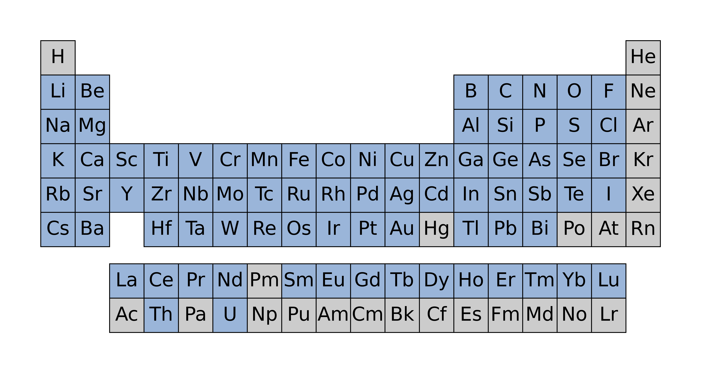
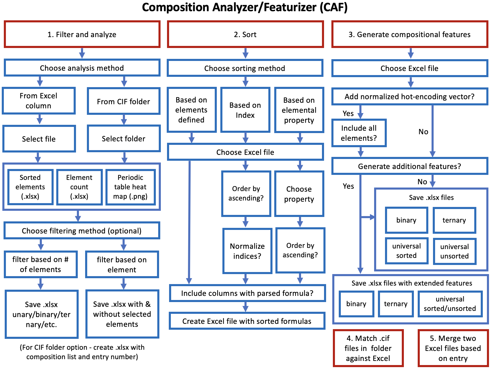
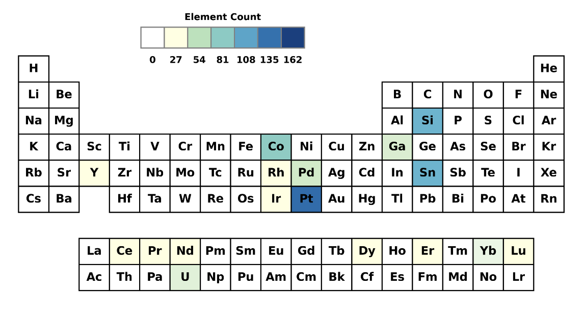

# Composition Analyzer Featurizer (CAF)


[](https://codecov.io/gh/bobleesj/composition-analyzer-featurizer)
[](https://github.com/psf/black)
[](https://github.com/bobleesj/composition-analyzer-featurizer/issues)

A Python package for generating compositional features for binary,
ternary, and quaternary formulas with Oliynyk elemental properties.

## Citation

If you use composition-analyzer-featurizer in a scientific publication,
we would like you to cite the package:

> Digital Discovery, https://doi.org/10.1039/D4DD00332B

Composition Analyzer/Featurizer (CAF) is a user-interactive Python
script that offers tools for generating compositional features from
Excel or `.cif` files.

It also provides interactive tools for tasks such as filtering, sorting
chemical formulas, and merging Excel files.

## Motivation

We developed CAF to aid solid-state chemists and materials scientists in
generating compositional training data ranging from dozens to tens of
thousands of compounds. Both experimentalists and novices can use this
tool to generate their own data with a basic understanding of Python.
The codebase is designed for easy customization by beginners.

## Scope

Formulas containing the following elements in blue are supported:



## Getting started without programming

To begin using `CAF`, follow these steps in your command-line interface:

```bash
# Download the code
git clone https://github.com/bobleesj/composition-analyzer-featurizer-app.git

# Navigate to the directory
cd composition-analyzer-featurizer-app

# Install CAF package
pip install composition-analyzer-featurizer

# Execute the script
python main.py
```

Upon running `python main.py`, you will be prompted to choose from one of the
following options by entering the corresponding number:

```text
Options:
1: Filter chemical formulas and generate periodic table heatmap
2: Sort chemical formulas in Excel
3: Create compositional features for formulas in Excel
4: Match .cif files in a folder against Excel
5: Merge two Excel files based on id/entry
Please enter the number of the option you want to run: 1
```

## Flow chart

Here is an overview of the 5 options:



## Options

CAF provides 5 interactive options detailed below.

**Option 1. Filter** - offers analysis capabilities for chemical formulas
already prepared in Excel sheets or a folder containing `.cif` files. It counts
and identifies unique elements present, detects errors within the data, and
generates a periodic table heatmap. Optionally, it provides two filtering
methods: one for removing specific elements and another for categorizing
compounds into unary, binary, ternary, and quaternary groups.



**Option 2. Sort** - rearranges a set of chemical formulas in an Excel file
based on 3 options.

1. **By label** - Sorts elements by a pre-configured label for each element.
   This option is applicable only for binary and ternary compounds. You may
   modify the predefined set of elements in `data/sort/custom-labels.xlsx` to add/remove any
   elements.

   ```text
   # Binary compounds
   A: Fe, Co, Ni, Ru, Rh, Pd, Os, Ir, Pt
   B: Si, Ga, Ge, In, Sn, Sb

   # Ternary compounds
   R: Sc, Y, La, Ce, Py, Nd, Pm, Sm, Eu, Gd, Tb, Dy, Ho, Er, Tm, Yb, Lu, Th, U
   M: Fe, Co, Ni, Ru, Rh, Pd, Os, Ir, Pt
   X: Si, Ga, Ge, In, Sn, Sb
   ```

2. **By index** - sorts compounds by stoichiometric ratio in either increasing
   or decreasing order. If the index is the same, the formulas are sorted based
   on the Mendeleev number.
3. **By property** - sorts by the value of an elemental chemical property,
   choosing from 27 options available in the Oliynyk database.

   ```text
   Available columns for sorting
   1. Atomic weight
   2. Atomic number
   3. Period
   4. Group
   5. Mendeleev number
   6. valence e total
   7. unpaired electrons
   8. Gilman no. of valence electrons
   9. Zeff
   10. Ionization energy (eV)
   11. CN
   12. ratio n closest/CN
   13. polyhedron distortion (dmin/dn)
   14. CIF radius element
   15. Pauling, R(CN12)
   16. Pauling EN
   17. Martynov Batsanov EN
   18. Melting point, K
   19. Density, g/mL
   20. Specific heat, J/g K
   21. Cohesive energy
   22. Bulk modulus, GPa
   23. Abundance in Earth's crust
   24. Abundance in solar system (log)
   25. HHI production
   26. HHI reserve
   27. cost, pure ($/100g)
   ```

**Option 3. Features -** generates compositional features for formulas in an
Excel file and, optionally, a composition-normalized vector using hot encoding.
The database for the featurziation is based on the Oliynyk (OLED) peer-reviewed
data ([DOI](https://doi.org/10.1016/j.dib.2024.110178)).

```text
Options:
  1: Filter chemical formulas and generate periodic table heatmap.
  2: Sort chemical formulas in an Excel file
  3: Create compositional features for formulas in an Excel file.
  4: Match .cif files in a folder against an Excel file.
  5: Merge two Excel files based on id/entry.
Please enter the number of the option you want to run: 3

Available Excel files with a 'Formula' column:
1. A-B database.xlsx
2. A-B features.xlsx
3. binary M-X.xlsx
4. binary_excel.xlsx
5. formulas.xlsx

Enter the number corresponding to the Excel file you wish to select: 5
Selected Excel file: /Users/imac/Downloads/CAF/formulas.xlsx
```

1. **For binary compounds**, 133 binary features defined in `feature/binary.py`
   are generated and saved in an Excel file.
2. **For ternary compounds**, 204 ternary features from `feature/ternary.py` are
   generated for each formula and stored in an Excel file.
3. **For all compounds**, regardless of the formula type, a universal set of 112
   sorted features and 156 unsorted (containing first and last element values)
   generated using `feature/universal.py`
4. (Optional) Extended features - You can generate an extensive list of features
   using `feature/universal_long.py`, `feature/binary_long.py`, and
   `feature/ternary_long.py`. These files include arithmetic operations provided
   in `feature/operation.py`. Any columns with overflow or undefined values are
   removed before the data is saved in Excel files. The column lengths can reach
   into the thousands.

Here is an example of the first few columns of `feature_binary.xlsx` for 3
binary formulas provided.

| Formula | index_A | index_B | normalized_index_A | normalized_index_B | largest_index | smallest_index | avg_index | atomic_weight_weighted_A+B |
| ------- | ------- | ------- | ------------------ | ------------------ | ------------- | -------------- | --------- | -------------------------- |
| NdSi2   | 1       | 2       | 0.333              | 0.667              | 2             | 1              | 1.5       | 144.242                    |
| Th2Os   | 2       | 1       | 0.667              | 0.333              | 2             | 1              | 1.5       | 464.076                    |
| Sn5Co2  | 5       | 2       | 0.714              | 0.286              | 5             | 2              | 3.5       | 593.55                     |

**Option 4. Match** - matches `.cif` files in a folder against an Excel file

This option allows the user to select a folder containing .cif files and an
Excel file. The Excel file should include an "Entry" column containing the IDs
of the .cif files. The script parses the IDs from the .cif files and compares
them with the entries in the Excel file. The Excel file is then updated to
filter and display only the entries that match the existing .cif files.

**Option 5. Merge** - combines two Excel files based on an "Entry" column.

User selects two Excel files to merge based on a common column labeled "Entry".
This feature is useful for combining datasets, such as one from a database and
another generated using this `CAF` (Composition Analyzer/Featurizer) or `SAF`
(Structure Analyzer/Featurizer)
[here](https://github.com/bobleesj/structure-analyzer-featurizer).

## Installation

Without Conda:

```bash
git clone https://github.com/bobleesj/composition-analyzer-featurizer-app.git
cd composition-analyzer-featurizer-app
pip install composition-analyzer-featurizer
python main.py
```

## How to ask for help

`CAF` is also designed for experimental materials scientists and chemists.

- If you would like to generate features for your interest of system, please
  feel free to reach out via email or
  [leave an issue](https://github.com/bobleesj/composition-analyzer-featurizer/issues).

## How to contribute

Here is how you can contribute to the `CAF` project if you found it helpful:

- Star the repository on GitHub and recommend it to your colleagues who might
  find `CAF` helpful as well.
  [](https://github.com/bobleesj/composition-analyzer-featurizer/stargazers)
- Fork the repository and consider contributing changes via a pull request.
  [](https://github.com/bobleesj/cifkit/network/members)
- If you have any suggestions or need further clarification on how to use `CAF`,
  please feel free to reach out to Sangjoon Bob Lee
  ([@bobleesj](https://github.com/bobleesj)).

## Contributors

- Alex Vtorov - feature
- Anton Oliynyk - project lead, ideation
- Danila Shiryaev - sort
- Emil Jaffal - filter
- Nikhil Kumar Barua - feature
- Sangjoon Bob Lee - development lead, integration

## Acknowledgements

`composition-analyzer-featurizer` is built and maintained with
[scikit-package](https://scikit-package.github.io/scikit-package/).
