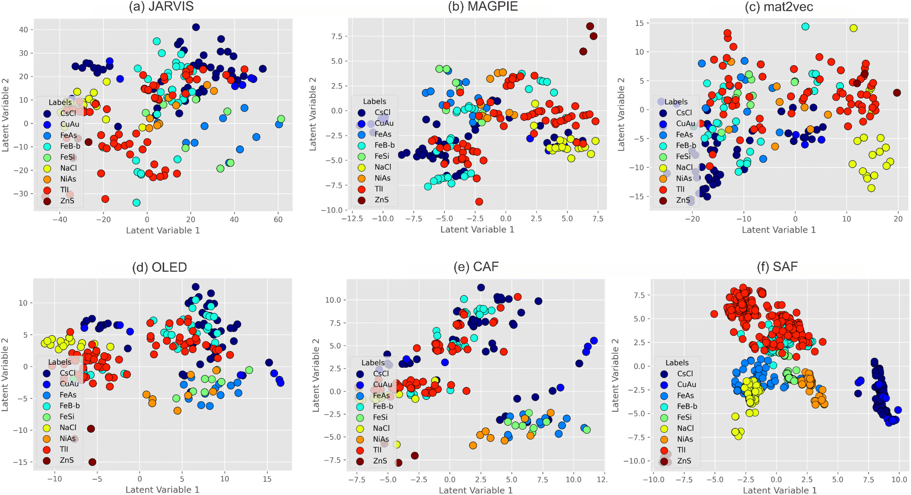
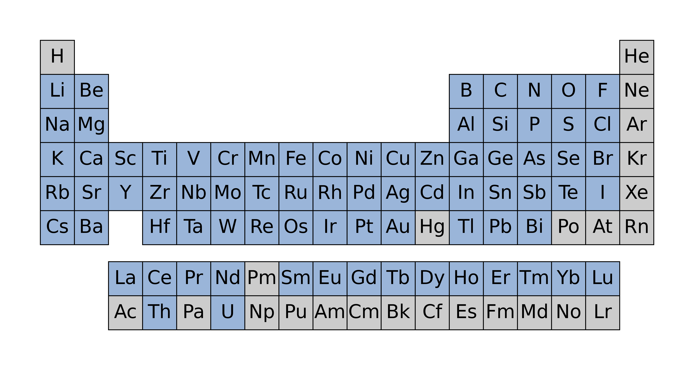
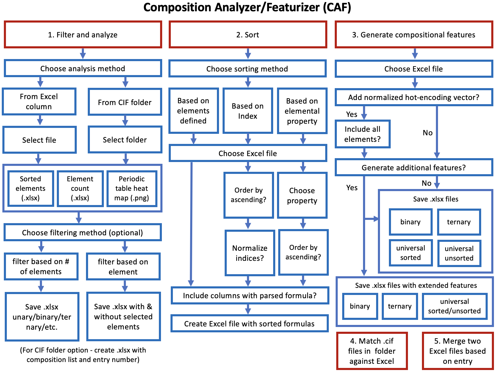

#######
|title|
#######

.. |title| replace:: Composition Analyzer/Featurizer (CAF)

.. image:: https://img.shields.io/badge/PR-Welcome-29ab47ff
   :alt: PR Welcome
   :target: https://github.com/bobleesj/composition-analyzer-featurizer/pulls
.. image:: https://img.shields.io/github/issues/bobleesj/composition-analyzer-featurizer
   :alt: GitHub issues
   :target: https://github.com/bobleesj/composition-analyzer-featurizer/issues
.. image:: https://img.shields.io/pypi/v/composition-analyzer-featurizer
   :alt: PyPI
   :target: https://pypi.org/project/composition-analyzer-featurizer/
.. image:: https://img.shields.io/pypi/pyversions/composition-analyzer-featurizer
   :alt: Python Version

| Software version |release|
| Last updated |today|.

Composition Analyzer/Featurizer (CAF) offers a user-interactive Python script that provides tools for generating compositional descriptors of binary, ternary, and quaternary compounds from Excel or `.cif` files. CAF also offers utility functions to filter, sort chemical formulas, and merge Excel files.

Citation
========

If you use ``CAF`` in your scientific publication, please cite the following:

- *Digital Discovery*. `https://doi.org/10.1039/D4DD00332B <https://doi.org/10.1039/D4DD00332B>`_

as well as the Oliynyk elemental property dataset (OLED) used in ``CAF``:

- *Data in Brief*. `https://doi.org/10.1016/j.dib.2024.110178 <https://doi.org/10.1016/j.dib.2024.110178>`_

Publications and scientific utility
===================================

In the above Digital Discovery paper (`DOI <https://doi.org/10.1039/D4DD00332B>`_), we describe the performance of CAF in combination with SAF for generating compositional and structural numerical features for ML applications in crystal classification of binary compounds. The results are shown in Figure 1 below, where we compare the performance of our developments (CAF and SAF) with existing feature generation methods such as JARVIS, MAGPIE, mat2vec, and OLED.

.. note::
   **Figure 1:** PLS-DA latent value plot using the first two latent value dimensions: (a) JARVIS, (b) MAGPIE, (c) mat2vec, (d) OLED (all sets of features were generated with CBFV), and our developments – (e) CAF and (f) SAF.

How CAF works
=============

For a given chemical formula, CAF determines the number of unique elements and categorizes them into binary, ternary, or quaternary compounds. It then generates a set of compositional features based on the chemical formula:

- 133 binary features
- 204 ternary features
- 305 quaternary features are generated

The features generated based on the elemental property Oliynyk elemental property dataset (`DOI <https://doi.org/10.1016/j.dib.2024.110178>`_). The full lists of features are provided in the :ref:`features` page.

Publications using CAF or Oliynyk elemental property
====================================================

Here is a list of publications using ``SAF`` for materials analysis and data-driven materials synthesis:

   .. [1] K. P. McGuinness, A. O. Oliynyk, S. Lee, B. Molero-Sanchez, P. K. Addo. Machine-learning prediction of thermal expansion coefficient for perovskite oxides with experimental validation. *Physical Chemistry Chemical Physics*. **25**, 32123-32131 (2023).
      `doi.org/10.1039/D3CP04017H <DOI	https://doi.org/10.1039/D3CP04017H>`_

   .. [2] N. K. Barua, S. Lee, A. O. Oliynyk, H. Kleinke. Thermoelectric Material Performance (zT) Predictions with Machine Learning. *ACS Applied Materials & Interfaces*. **4**, 548-560 (2024).
      `doi.org/10.1016/j.jallcom.2023.173241 <https://doi.org/10.1016/j.jallcom.2023.173241>`_

   .. [3] S. S. Sethi, A. Dutta, E. I. Jaffal, N. Yadav, D. Shiryaev, B. Hoang, A. Machathi, S. Lee, K. Das, P. P. Jana, A. O. Oliynyk. Unsupervised Machine Learning Prediction of a Novel 1:3 Intermetallic Phase with the Synthesis of TbIr3 (PuNi3-type) as Experimental Validation. *Journal of the American Chemical Society*. **17**, 1662-1673 (2025).
      `doi.org/10.1021/jacs.5c03510 <https://doi.org/10.1021/jacs.5c03510>`_

   .. [4] J S. V. Buskirk G. G. C. Peterson, D. C. Fredrickson. Machine Learning-Based Investigation of Atomic Packing Effects: Chemical Pressures at the Extremes of Intermetallic Complexity. *Journal of the American Chemical Society*. **17**, 1662-1673 (2024).
      `doi.org/10.1021/jacs.4c10479 <https://doi.org/10.1021/jacs.4c10479>`_

   .. [5] A. Sundar, X. Tan, S. Hu, M. C. Gao. CALPHAD-based Bayesian optimization to accelerate alloy discovery for high-temperature applications. *Journal of Materials Research*. **40**, 112–122 (2025).
      `doi.org/10.1557/s43578-024-01489-0 <https://doi.org/10.1557/s43578-024-01489-0>`_

   .. [6] K. Li, T. Du, R. Zhou, Q. Fan. Multi-Objective optimization of material properties for enhanced battery performance using artificial Intelligence. *Expert Systems with Applications*. **288**, 128179 (2025).
      `doi.org/10.1016/j.eswa.2025.128179 <https://doi.org/10.1016/j.eswa.2025.128179>`_

   .. note::

      The Oliynyk elemental property dataset can be easily easily accessed through ``bobleesj.utils`` in https://bobleesj.github.io/bobleesj.utils/notebooks/Oliynyk.html.

Getting started
===============

You can simply generate compositional features using our application so that you don't have to write any code. Please visit :ref:`getting-started` to learn how to generate features.

Scope
=====

There are two constraints. First, formulas of either **binary**, **ternary**, or **quaternary** compounds are supported. Second, formulas containing the elements in blue below are supported:

5 Options provided in CAF App
=============================

The recommended way to generate features is using the interactive application. Beyond generating features from a list of formulas listed in an Excel file under the "Formula" column, there are other utility options that can help you filter, sort, and merge Excel files which are used for generating features and handling data.

How to ask for help
===================

- Do you have any feature requests? Please feel free to open an `issue <hhttps://github.com/bobleesj/composition-analyzer-featurizer/issues/>`_ on GitHub using the ``Bug Report or Feature Request`` template.
- Do you have any questions about running the code? Please feel free to reach out to Sangjoon Bob Lee at bobleesj@gmail.com.
- Do you want to learn how to publish scientific software? ``CAF`` is developed and maintained using the Level 5 package standards provided in `scikit-package <https://scikit-package.github.io/scikit-package/>`_.

How you can contribute to CAF
=============================

- Did you find CAF helpful? You can show support by starring the `GitHub repository <https://github.com/bobleesj/composition-analyzer-featurizer>`_ and recommending it to colleagues.
- Did you find any bugs? Please feel free to report it by creating a new issue so that we can fix it as soon as possible.-

.. seealso::

   Do you want to learn how to use GitHub and develop Python package to reuse your code? Please feel free to reach out to Sasngjoon Bob Lee (bobleesj@gmail.com). There are resources you can use to get started such as `scikit-package <https://scikit-package.github.io/scikit-package/>`_.

.. image:: img/scikit-package-logo-text.png
   :alt: scikit-package logo
   :align: center
   :width: 400px
   :target: https://scikit-package.github.io/scikit-package

Authors
=======

- `Sangjoon Bob Lee <https://github.com/bobleesj>`_ - development lead, maintainer
- `Anton Oliynyk <https://github.com/OliynykLab>`_ - development lead, feature design
- `Emil Jaffal <https://github.com/EmilJaffal>`_ - filter
- `Danila Shiryaev <https://github.com/dshirya>`_ - sort
- Alex Vtorov - feature
- Nikhil Kumar Barua - feature

Acknowledgements
================

``CAF`` is built and maintained with `scikit-package <https://scikit-package.github.io/scikit-package/>`_.

.. toctree::
   :maxdepth: 2
   :caption: GUIDES
   :hidden:

   getting-started
   app

.. toctree::
   :maxdepth: 2
   :caption: REFERENCE
   :hidden:

   features
   Package API <api/CAF>
   release
   license
